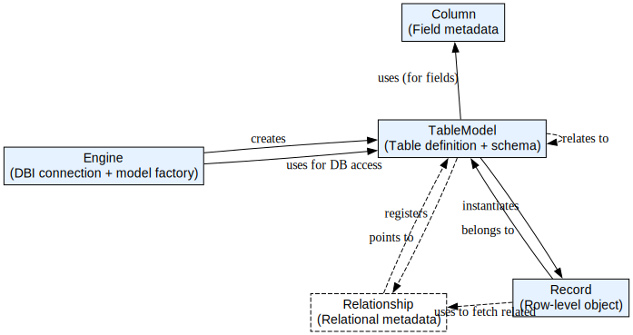

# oRm: An Object-Relational Mapping (ORM) Framework for R

oRm is an open-source Object-Relational Mapping (ORM) framework for R, designed to simplify the process of interacting with databases in R. It provides a flexible and intuitive way to define models, perform CRUD operations, and build complex queries.

## Installation

You can install the latest version of oRm from GitHub using the `remotes` package:

```r
if (!require(remotes)) {
  install.packages("remotes")
}
remotes::install_github("kent-orr/oRm")
```

## Getting Started
To get started with oRm you will want to create an engine and define object models. An engine passes args to a DBI::dbConnect call, so it can interface with most any database that DBI can. 


```r
library(oRm)

engine <- Engine$new(
    drv = RSQLite::SQLite(),
    dbname = ":memory:"
  )

User = engine$model(
  tablename = "users",
  name = Column('VARCHAR'),
  id = Column('INTEGER')
)

User$create_table()

new_user = Record$new(User, list(id = 1, name = "John Doe"))
new_user$create()

second_user = Record$new(User, list(id = 2, name = "Jane Doe"))
second_user$create()

DBI::dbGetQuery(engine$get_connection(), "SELECT * FROM users")

second_user$delete()
DBI::dbGetQuery(engine$get_connection(), "SELECT * FROM users")

User$

```

